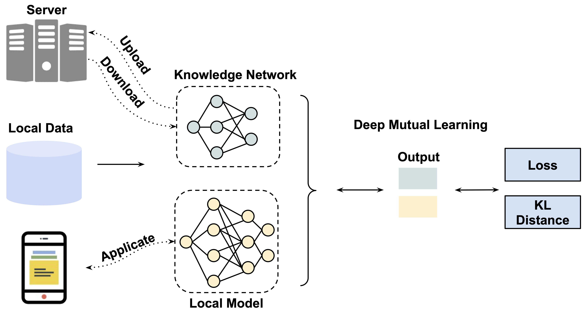
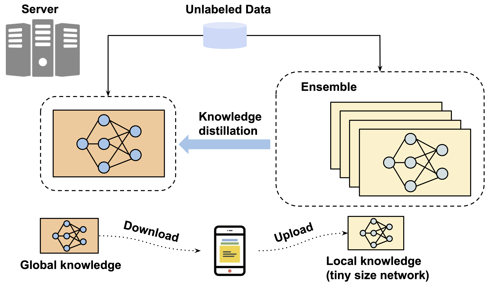

# FedKEMF 
FedKEMF: Resource-aware **Fed**erated Learning using  **K**nowledge **E**xtraction and **M**ulti-model **F**usion
## Dependencies

Current code base is tested under following environment:

1. Python   3.9
2. PyTorch  1.12.1 (cuda 11.3)
3. torchvision 0.13.1
4.scikit-learn 1.1.2
5. tensorboard 2.10.0
6. matplotlib 3.5.3


## FedKEMF Overview –– Efficient federated learning
FedKEMF is a resource-aware FL algorithm, which aggregate an ensemble of local knowledge extracted from edge models. 
Different from exsisting works which aggregate the weights of each local model, FEDKEMF is distilled into a robust global knowledge as the server model through knowledge distillation.

**Client local updates**

Download knowledge network from cloud server and optimize it jointly
with local model.

**Multi-model Fusion in cloud**

Could server ensemble all the selected client models, and distillate the
ensemble model's knowledge to cloud model.

In this repository, we provide efficient federated learning experimental evaluation using FedKEMF. 
We test FedKEMF
on ResNet20, ResNet32, ResNet44, VGG-11/16, and 2-layer simple CNN on various benchmark Non-IID federated learning settings.

### Usage
#### Running experiments through using Docker container
The instruction for build the docker image for FedKEMF can be find in [Docker/README.md](Docker/README.md).
Please follow the requirements to build the docker image. To reproducing the experiments, please follow the 
instruction.

#### Running experiments through Python scripts
We highly recommend you create a conda virtual environment before you start the experiment.
Instructions can be found in [Anaconda](https://docs.conda.io/projects/conda/en/latest/user-guide/tasks/manage-environments.html).

After creating the environment, installing the dependencies with the correct versions:
- Installing PyTorch 1.12.1 (cuda11.3)
```python
conda install pytorch torchvision torchaudio cudatoolkit=11.3 -c pytorch
```
- Installing support packages 
```python
pip install -r requirements.txt
```

##### Experiment on Non-IID CIFAR-10
After configured all the dependencies, we can conduct the experiment.

In this subsection, clients are trained on CIFAR-10 with Non-IID settings.

Train ResNet-32 200 rounds with 10 clients and sample ratio = 1:
   ```
python3 knowlege_aggregation.py --comm_round=400 --k_model='resnet20' --model='resnet32' --dataset=cifar100 --batch-size=128 --epochs=20 --n_parties=10 --sample=0.7 --logdir='./logs/'
   ```
Train vgg-11 200 rounds with 30 clients and sample ratio = 0.7:
  ```angular2html
python3 knowlege_aggregation.py --comm_round=400 --k_model='resnet20' --model='resnet32' --dataset=cifar100 --batch-size=128 --epochs=20 --n_parties=10 --sample=0.7 --logdir='./logs/'
   ```

##### Multi-model experiment
Multi-model experiment will randomly initialize the FL system with different type of client models.
To run the multi-model experiments, you need enable the argument `--env=multi-model`:
  ```angular2html
python3 knowlege_aggregation.py --comm_round=400 --k_model='resnet20' --env=multi-model --dataset=cifar100 --batch-size=128 --epochs=20 --n_parties=10 --sample=0.7 --logdir='./logs/'
   ```
